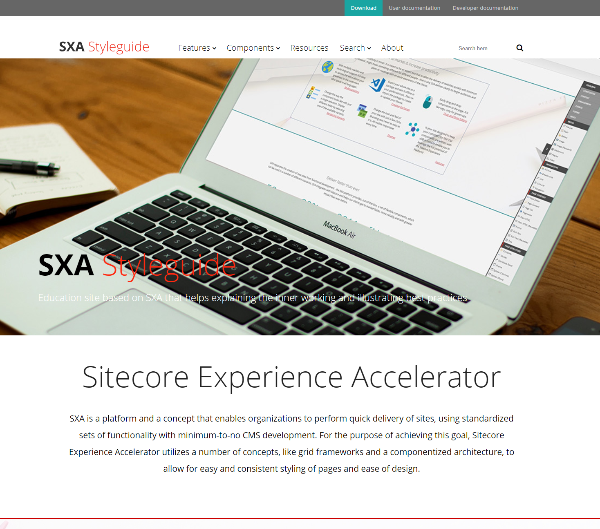

The SXA Styleguide is an education site based on SXA that helps explaining the inner working and illustrating best practices. 

It should not be considered as a demo environment for SXA or Sitecore in general. For demo purposes we like to refer you to [Habitat Home](https://github.com/Sitecore/Sitecore.HabitatHome.Platform), the official demo environment maintained by Sitecore and available as open-source.

## Requirements
The Styleguide is built to support **[Sitecore Experience Platform 9.3](https://dev.sitecore.net/Downloads/Sitecore_Experience_Platform/93/Sitecore_Experience_Platform_93_Initial_Release.aspx)** using **[Sitecore Experience Accelerator (SXA) 9.3](https://dev.sitecore.net/Downloads/Sitecore_Experience_Accelerator/9x/Sitecore_Experience_Accelerator_930.aspx)**.

## Installation
You can install the styleguide on a Sitecore 9.3 instance with SXA 9.3 installed. Installation can be done using the package you can download from the [releases page](https://github.com/markvanaalst/SXA.Styleguide/releases).

## Running the Stylguide on Docker

### Requirements

1. Windows 1809 or higher, but prefer version 1909  
2. The latest Docker Desktop **[Docker Desktop](https://docs.docker.com/docker-for-windows/install/)** 
3. From the Docker Desktop menu, you can toggle which daemon (Linux or Windows) the Docker CLI talks to. Select Switch to Windows containers to use `Windows containers`
4. Pre-build [docker-images](https://github.com/Sitecore/docker-images/blob/master/README.md) local or taken from your own `ACR` 

### Starting the Styleguide

1. Clone or copy the repository
2. Open `SXA.Styleguide.sln` in Visual Studio 2019
3. Build solution
4. Make sure your license file is located under `C:\License\license.xml`
5. Run `docker-compose up -d`
6. Browse to [http://localhost:44001/unicorn.aspx](http://localhost:44001/unicorn.aspx) en run the Unicorn sync

## Acknowledgements

I would like to thank the following people for their support and contributions:
- [Michael West](http://twitter.com/michaelwest101) for adding Docker support
- [Sebastian Winter](http://twitter.com/lovesitecore) for all the feedback provided
- [Adam Najmanowicz](http://twitter.com/adamnaj) for reviewing, feedback and his patience :-)
***
#### Support
The code, samples and/or solutions provided in this repository are unsupported by Sitecore Support. Support is provided on a best-effort basis via GitHub issues.

It is assumed that you already have a working instance of Sitecore XM and all prerequisites prior to installing the demo. Support for product installation issues should be directed to relevant Community channels or through regular Sitecore support channels.

#### Warranty
The code, samples and/or solutions provided in this repository are for example purposes only and without warranty (expressed or implied). The code has not been extensively tested and is not guaranteed to be bug free.

